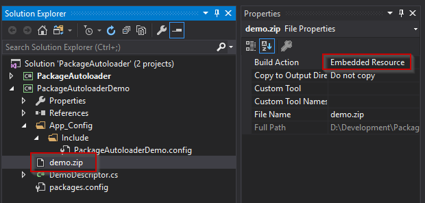

# Sitecore Package Autoloader
Automate deployment and installation of packages to the Sitecore initalize pipeline

## Example Usages

+ A default content state:
	* If you have a particular intial set of content that you only want deployed once ever. 
+ Field based integrity check:
	* If you want to validate the value of a particular field to trigger the install.
+ Time based check:
	* Use custom logic to build a time span that the package should be installed within
+ Custom rules for installation:
	* If you have custom business logic that should determine if the package should be installed.


## How it works.
For an example review the PackageAutoLoaderDemo project in this repo

### Descriptors
Descriptors describe to the module what, where and how things should be installed.  All descriptors require or allow certain options to be present.
Out of the box descriptors include PackageAutoloaderDescriptor which allow the embedding of zip files into dll files to simplify build/release needs and PackageFileLoaderDescriptor which manages a package from a filepath location that another process will deliver to.
+ GetRelativeFilePath()
	* This determines where the package to be installed lives
	* Note the PackageAutoloaderDescriptor will handle this automatically based on the embedded resource namespace
+ Requirements
	* Item and field level requirements that if met will determine if the package has already been installed
+ AllDescriptorItemRequirementsMustBeValid
	* Default: true
	* A false value indicates that this package will be installed if any requirement is not met, if true then it only installs if ALL requirements are not met
+ Dependencies
	* Default: null
	* A list of types that this descriptor depends on.  Each type in this list will be installed before this descriptor.
+ ItemInstallerEvents
	* Default: overwrite undefined
	* The behavior that Sitecore should take when installing the package defined by the descriptor
+ FileInstallerEvents
	* Default: DefaultFileInstallerEvents(true)
	* Customize the OOTB Sitecore default file installer events
+ CustomRequirements()
	* Default: true
	* Custom logic to be applied to this descriptor should be added here.
	
## Two stock types of descrptors
### Autoloader type (embedded resource)
You would use this type of loader if you have small packages that won't cause problems loaded into memory with the DLL and you don't want to fiddle with a custom deploy method for your packages.
+ Create the package you wish to install using Sitecore
+ Install the nuget package [here](https://www.nuget.org/packages/PackageAutoLoader/).
+ Add your package to a visual studio project folder
	* Copy/paste your package into an area controlled by a VS project and add it to your csproj
+ In the properties of the package item in visual studio change the build action to "Embedded Resource"
	* Right click -> Properties -> Build Action = "Embedded Resource"
	* This will embed the package into your dll.
+ Add a class extending PackageAutoloaderDescriptor
	* Note the package namespace is the base csproj namespace plus any folders using a '.' delimitor.  For example if you had a project with a root namespace "MyPackageProject" and your zip file was added at /Packages/MyPackage.zip then your package namespace would be "MyPackageProject.Packages.MyPackage.zip"
+ Implement your logic for installation using either the built in item/field validation or custom logic


### File Loader type (filesystem resource)
You would use this type of loader if you have a large package that would would problematic to load into memory and you have a process to deploy the packages to the server.
NOTE:  This location can be anywhere accessable by the web server.
+ Create the package you wish to install using Sitecore
+ Install the nuget package [here](https://www.nuget.org/packages/PackageAutoLoader/).
+ Add your package to a location that will be deployed to each environment.
	* Any way you choose to facilitate this will be fine as long as it's located in an accessable location
+ Add a class extending PackageFileloaderDescriptor
	* Note the required path is relative to the webroot
+ Implement your logic for installation using either the built in item/field validation or custom logic

## Descriptor examples

### If an item with a particular ID is missing from Sitecore
```cs
	public class DemoDescriptor : PackageAutoloaderDescriptor
	{
		public override string PackageNamespace => "PackageAutoloaderDemo.demo.zip";
		public override List<DescriptorItemRequirements> Requirements => new List<DescriptorItemRequirements>()
		{
			new DescriptorItemRequirements()
			{
				Database = "master",
				ItemId = new ID("{76036F5E-CBCE-46D1-AF0A-4143F9B557AA}")
			}
		};
	}
```
### If an item with a set particular field value exists, must match all fields
```cs
	public class DemoDescriptor : PackageAutoloaderDescriptor
	{
		public override string PackageNamespace => "PackageAutoloaderDemo.demo.zip";

		public override List<DescriptorItemRequirements> Requirements => new List<DescriptorItemRequirements>()
		{
			new DescriptorItemRequirements()
			{
				Database = "master",
				ItemId = new ID("{76036F5E-CBCE-46D1-AF0A-4143F9B557AA}"),
				RequiredFields = new List<KeyValuePair<ID, string>>()
				{
					new KeyValuePair<ID, string>(new ID("{1036F5E-CBCE-46D1-AF0A-4143F9B529QZ}"), "SOME STUFF"),
					new KeyValuePair<ID, string>(new ID("{413478C3-5C14-4B27-8FA5-C1449BABE71A}"), "SOME OTHER STUFF")
				}
			}
		};
	}
```
### If an item with one of several fields that matches, they don't all need to, just one
```cs
	public class DemoDescriptor : PackageAutoloaderDescriptor
	{
		public override bool AllDescriptorItemRequirementsMustBeValid => false;
		public override string PackageNamespace => "PackageAutoloaderDemo.demo.zip";

		public override List<DescriptorItemRequirements> Requirements => new List<DescriptorItemRequirements>()
		{
			new DescriptorItemRequirements()
			{
				Database = "master",
				ItemId = new ID("{76036F5E-CBCE-46D1-AF0A-4143F9B557AA}"),
				RequiredFields = new List<KeyValuePair<ID, string>>()
				{
					new KeyValuePair<ID, string>(new ID("{1036F5E-CBCE-46D1-AF0A-4143F9B529QZ}"), "SOME STUFF"),
					new KeyValuePair<ID, string>(new ID("{413478C3-5C14-4B27-8FA5-C1449BABE71A}"), "SOME OTHER STUFF")
				}
			}
		};
	}
```
### If the current date is before a specific time
```cs	
public class DemoDescriptor : PackageAutoloaderDescriptor
	{
		public override string PackageNamespace => "PackageAutoloaderDemo.demo.zip";
		public override bool CustomRequirement()
		{
			return DateTime.Now < new DateTime(2020, 1, 22);
		}

		public override List<DescriptorItemRequirements> Requirements => new List<DescriptorItemRequirements>();
	}
```
### If the custom logic passes
```cs
	public class DemoDescriptor : PackageAutoloaderDescriptor
	{
		public override string PackageNamespace => "PackageAutoloaderDemo.demo.zip";
		public override bool CustomRequirement()
		{
			// Any kind of business logic you need
			return Sitecore.Configuration.Settings.RecycleBinActive;
		}

		public override List<DescriptorItemRequirements> Requirements => new List<DescriptorItemRequirements>();
	}
```
### If you want to update the install behavior for the package
Note here we're using the file path package
```cs
	public class DemoDescriptor2 : PackageFileLoaderDescriptor
	{
		public override IItemInstallerEvents ItemInstallerEvents => 
			new DefaultItemInstallerEvents(new BehaviourOptions(InstallMode.Overwrite, MergeMode.Undefined));

		public override List<DescriptorItemRequirements> Requirements => null;


		public override string RelativeFilePath => "/PackageAutoloader/demo2.zip";
	}
```
### If you want to install a package that has a dependency on another package
Note here we're using the file path package
```cs
	public class DemoDescriptor3 : PackageFileLoaderDescriptor
	{
		public override List<Type> Dependencies => new List<Type>
		{
			typeof(DemoDescriptor2)
		};

		public override List<DescriptorItemRequirements> Requirements => new List<DescriptorItemRequirements>()
		{
			new DescriptorItemRequirements()
			{
				Database = "master",
				ItemId = new ID("{FEAB7DBD-7FFA-405F-939D-402093C02A81}")
			}
		};

		public override string RelativeFilePath => "/PackageAutoloader/demo3.zip";
	}
```

## Custom Descriptors
If you have a particular model that you regularly follow, you can easilly create your own or extend an existing descriptor by Extending the DescriptorBase abstract class.